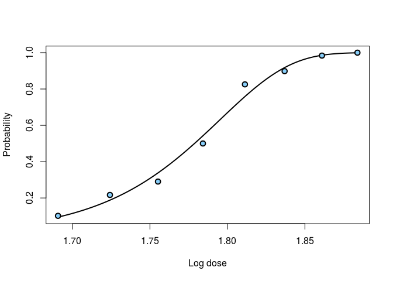
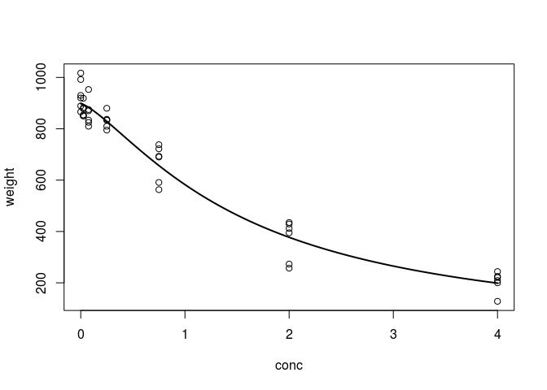

<!-- README.md is generated from README.Rmd. Please edit that file -->
[](http://cran.r-project.org/package=investr) [](https://travis-ci.org/bgreenwell/investr) [](https://codecov.io/github/bgreenwell/investr?branch=master) [](http://cranlogs.r-pkg.org/badges/investr) [](http://cranlogs.r-pkg.org/badges/grand-total/investr)

investr: Inverse Estimation in R
================================

Inverse estimation, also referred to as the calibration problem, is a classical and well-known problem in regression. In simple terms, it involves the use of an observed value of the response (or specified value of the mean response) to make inference on the corresponding unknown value of an explanatory variable.

A detailed introduction to investr has been published in The R Journal: "investr: An R Package for Inverse Estimation", <http://journal.r-project.org/archive/2014-1/greenwell-kabban.pdf>. You can track development at <https://github.com/bgreenwell/investr>. To report bugs or issues, contact the main author directly or submit them to <https://github.com/bgreenwell/investr/issues>.

As of right now, `investr` supports (univariate) inverse estimation with objects of class:

-   `"lm"` - linear models (multiple predictor variables allowed)
-   `"glm"` - generalized linear models (multiple predictor variables allowed)
-   `"nls"` - nonlinear least-squares models
-   `"lme"` - linear mixed-effects models (fit using the `nlme` package)

Installation
------------

The package is [currently listed on CRAN](http://cran.r-project.org/package=investr) and can easily be installed:

``` r
  # Install from CRAN
  install.packages("investr", dep = TRUE)
  
  # Alternatively, install the development version from GitHub
  devtools::install_github("bgreenwell/investr")
```

The package is also part of the [ChemPhys task view](http://cran.r-project.org/web/views/ChemPhys.html), a collection of R packages useful for analyzing data from chemistry and physics experiments. These packages can all be installed at once (including `investr`) using the `ctv` package (Zeileis, 2005):

``` r
  # Install the ChemPhys task view
  install.packages("ctv")
  ctv::install.views("ChemPhys")
```

Examples
--------

### Dobson's Beetle Data

In binomial regression, the estimated lethal dose corresponding to a specific probability *p* of death is often referred to as *LDp*. `invest` obtains an estimate of *LDp* by inverting the fitted mean response on the link scale. Similarly, a confidence interval for *LDp* can be obtained by inverting a confidence interval for the mean response on the link scale.

``` r
# Load required packages
library(investr)

# Binomial regression
beetle.glm <- glm(cbind(y, n-y) ~ ldose, data = beetle, 
                  family = binomial(link = "cloglog"))
plotFit(beetle.glm, lwd.fit = 2, cex = 1.2, pch = 21, bg = "lightskyblue", 
        lwd = 2, xlab = "Log dose", ylab = "Probability")
```



``` r

# Median lethal dose
invest(beetle.glm, y0 = 0.5)   
#> estimate    lower    upper 
#> 1.778753 1.770211 1.786178

# 90% lethal dose
invest(beetle.glm, y0 = 0.9)   
#> estimate    lower    upper 
#> 1.833221 1.825117 1.843068

# 99% lethal dose
invest(beetle.glm, y0 = 0.99)  
#> estimate    lower    upper 
#> 1.864669 1.853607 1.879133
```

To obtain an estimate of the standard error, we can use the Wald method:

``` r
invest(beetle.glm, y0 = 0.5, interval = "Wald")
#>  estimate     lower     upper        se 
#> 1.7787530 1.7709004 1.7866057 0.0040065

# The MASS package function dose.p can be used too 
MASS::dose.p(beetle.glm, p = 0.5)
#>              Dose         SE
#> p = 0.5: 1.778753 0.00400654
```

### Including a factor variable

Multiple predictor variables are allowed for objects of class `lm` and `glm`. For instance, the example from `?MASS::dose.p` can be re-created as follows:

``` r
# Load required packages
library(MASS)

# Data
ldose <- rep(0:5, 2)
numdead <- c(1, 4, 9, 13, 18, 20, 0, 2, 6, 10, 12, 16)
sex <- factor(rep(c("M", "F"), c(6, 6)))
SF <- cbind(numdead, numalive = 20 - numdead)
budworm <- data.frame(ldose, numdead, sex, SF)

# Logistic regression
budworm.glm <- glm(SF ~ sex + ldose - 1, family = binomial, data = budworm)

# Using dose.p function from package MASS
dose.p(budworm.glm, cf = c(1, 3), p = 1/4)
#>               Dose        SE
#> p = 0.25: 2.231265 0.2499089

# Using invest function from package investr
invest(budworm.glm, y0 = 1/4, 
       interval = "Wald",
       x0.name = "ldose", 
       newdata = data.frame(sex = "F"))
#>  estimate     lower     upper        se 
#> 2.2312647 1.7414522 2.7210771 0.2499089
```

### Bioassay on Nasturtium

The data here contain the actual concentrations of an agrochemical present in soil samples versus the weight of the plant after three weeks of growth. These data are stored in the data frame `nasturtium` and are loaded with the package. A simple log-logistic model describes the data well:

``` r
# Log-logistic model for the nasturtium data
nas.nls <- nls(weight ~ theta1/(1 + exp(theta2 + theta3 * log(conc))),
               start = list(theta1 = 1000, theta2 = -1, theta3 = 1),
               data = nasturtium)
               
# Plot the fitted model
plotFit(nas.nls, lwd.fit = 2)
```



Three new replicates of the response (309, 296, 419) at an unknown concentration of interest (*x*<sub>0</sub>) are measured. It is desired to estimate *x*<sub>0</sub>.

``` r
# Inversion method
invest(nas.nls, y0 = c(309, 296, 419), interval = "inversion")
#> estimate    lower    upper 
#> 2.263854 1.772244 2.969355


# Wald method
invest(nas.nls, y0 = c(309, 296, 419), interval = "Wald")  
#>  estimate     lower     upper        se 
#> 2.2638535 1.6888856 2.8388214 0.2847023
```

The intervals both rely on large sample results and normality. In practice, the bootstrap may be more reliable:

``` r
# Bootstrap calibration intervals (may take a few seconds)
boo <- invest(nas.nls, y0 = c(309, 296, 419), interval = "percentile", 
              nsim = 9999, seed = 101)
boo  # print bootstrap summary
#>  estimate     lower     upper        se      bias 
#> 2.2638535 1.7889885 2.9380360 0.2946540 0.0281456
plot(boo)  # plot results
```


